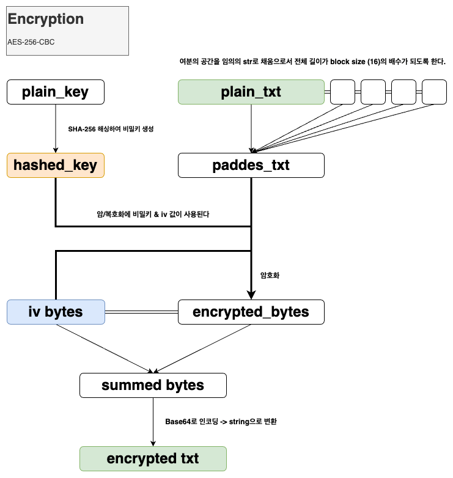

# example-aes-256-py

This is a demo project that demonstrates how AES-based encryption & decryption workes on the code. 
Hopefully this will be helpful to understand the basic process of the <strong>end-to-end data security</strong> between web pages and server application. 
(It may require additional package installation.) 

## How does AES-256-CBC encryption work?
1. Create secret key with the algorithm like SHA-256 hashing.
2. Additional (blank) buffers will be padded at the end of the original data to make sure <strong>the whole data length will be multiple of the block size. (mostly 16)</strong>
3. Encrypt the data above with secret key & <strong>IV(Initialization Vector)</strong> data. (IV is used for the encryption of the block initialization)
4. Combine IV & encrypted data in <strong>base64</strong> format as the result.

 